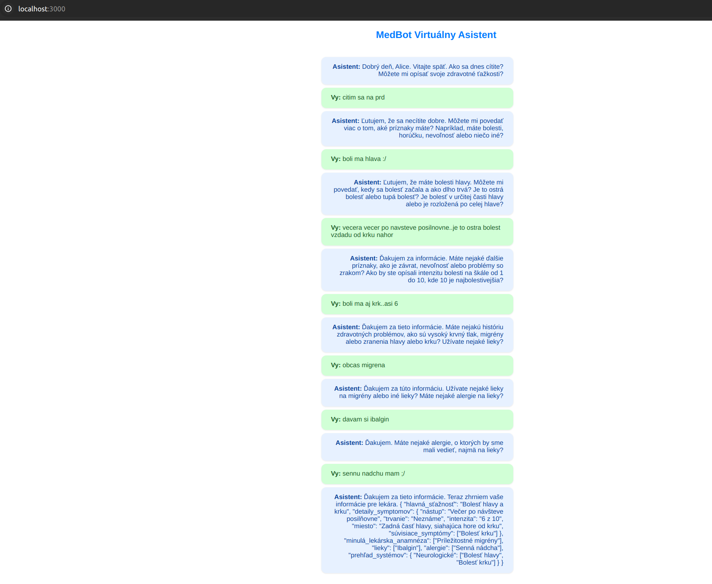

# Medbot Frontend

The frontend interface for Medbot, a medical chatbot designed to assist users in understanding their health conditions and providing a structured summary for a general practicioner.

## Features

- **User-friendly Interface**: Intuitive design for seamless interaction.
- **Real-time Responses**: Instant feedback based on user inputs.
- **Medical Information**: Access to a wide range of medical data and suggestions.

## Screenshot



## Technologies Used

- **React**: For building the user interface.
- **Axios**: For making HTTP requests to the backend.
- **Bootstrap**: Responsive design and styling.

## Installation

To set up the project locally:

1. Clone the repository:

   ```bash
   git clone https://github.com/quirkfly/medbot-frontend.git
   cd medbot-frontend
   ```

2. Install dependencies:

   ```bash
   npm install
   ```

3. Start the development server:

   ```bash
   npm start
   ```

   The application will be available at `http://localhost:3000`.

## Usage

Once the application is running, navigate through the interface to interact with the Medbot. Input your symptoms or queries, and Medbot will provide relevant information and suggestions.

## Contributing

Contributions are welcome! Please fork the repository, make your changes, and submit a pull request. Ensure that your code adheres to the project's coding standards and includes appropriate tests.

## License

This project is licensed under the MIT License.
